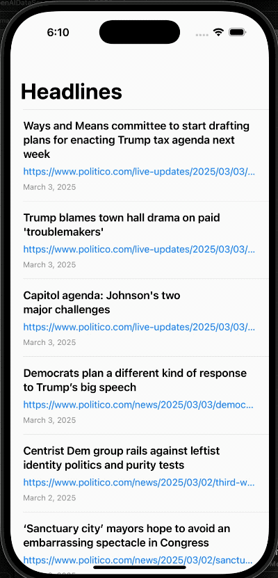

# ItsFine

**Its Fine: The news reader that understands ignorance is bliss**

---

## 📺 **Welcome to ItsFine!**

Tired of doomscrolling through headlines? Fear not! **ItsFine** is here to save the day by transforming those tear-inducing headlines into something a tad more... bearable.



Remember, when life gives you alarming headlines, just shake your phone and say, "It's Fine." 😌📱

---

## 📰 **What is ItsFine?**

ItsFine is an AI-powered RSS reader designed to fetch and display the latest news headlines. It leverages OpenAI’s Chat Completions API to transform news headlines based on prompting, when the user performs a shake gesture.

---

## 🛠 **Installation**

1. **Clone the Repository:**
   ```bash
   git clone https://github.com/yourusername/ItsFine.git
   ```
2. **Open in Xcode:**
   Navigate to the project directory and open `ItsFine.xcodeproj`.
3. **Set Up API Keys:**
   - Create a `APIKeys.swift` file.
   - Add your OpenAI API key:
     ```swift
     struct APIKeys {
         static let openAIKey: String = "YOUR_KEY_HERE"
     }
     ```
4. **Build and Run:**
   Hit the **Run** button in Xcode to build and launch the app on your device or simulator.

---

## 📜 **License**

This project is licensed under the MIT License. You are free to use, modify, and distribute this software as long as you include the original license and copyright notice.

---

## 💡 **Future Enhancements**

- **User-Added RSS Feeds:** Allow users to add their own RSS sources for a more personalized news experience. Right now Politico is hard coded.
- **Custom Prompting:** Allow users to provide custom prompts. Right now it transforms multiple levels of 'optimism', but we could make this AI filter reality in anyway we desire.

---
